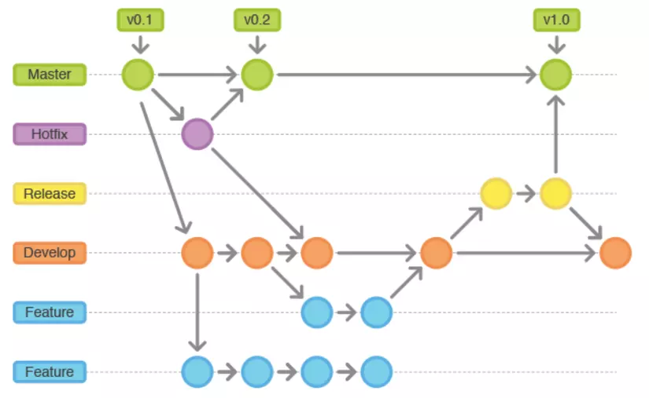

# Git Flow - Why and How to use:  
 GitFlow is a collection of Git commands to define a strict branching model designed around the project release for Vincent Driessen's [branching model](http://nvie.com/git-model "original blog post"). 
  
Git Flow is really just an abstract idea of a Git workflow. This means it dictates what kind of branches to set up and how to merge them together. The git-flow toolset is an actual command line tool that has an installation process.Git-flow extension is a wrapper around Git.

The main concept to apply Gitflow to the team.
- Manage branches in git repository.
  - Main code branch.
  - Release code branch.
  - Development branch.
  - Feature, bugfix, hotfix....
- How to initial new branch? What is the source branch to initial new branch whenever starting new feature, bugfix or hotfix?.
- How to naming the branch?
- How to merge the branch?
- Human first.
- Tools just to support to help the work easier. Gitflow can be applied without any tool.

## Why should use git flow:  
- GitFlow is a collection of Git commands to provide many repository operations with just single command.  
- It was developed to manage the branching mechanism with a standardised approach when developing features,  
  handling releases and managing hotfixes.  
- Using multiple separate branches in Git will provide flexibility but gets complex. This is easy in gitflow.  
- It makes developer speed up the process with familiar branch structure.  
 - Switching branches is easy.  
 - Keep repository & process clean and tidy.  

## Branches in Git Flow
- `master/main`: Default branch of git. Contain main code of project and the only branch to deploy to production. When a release is made, the code should be merge to `main` first.
- `release`: The branches that support during the release or pre-release.
- `develop`: The branch using during development process. This code will be deployed to test server.
- `feature`: The branch crating during development to work on feature or task.
- `bugfix`: The branch using to fix bug during development process.
- `hotfix`: The branch use to hotfix the bug in production.

## Branch note
- One `feature` branch only to work on one feature.
- One `bugfix` branch only to work on a bug.
- One person one branch, never let multiple people work on same branch.
- Local branch and remove branch should have a same name.
- Code should be push frequently, at lest once a day.
- Branch merging should be done by `Pull Request`, should not merge on local.
- Every `Pull Request` should be get reviewed.
- Merging to `main` should only done by one person that give the privilege. Never push to `main`, `develop`, `release`.
- After `Pull Request` is merged and branch no longer in use, the branch should be removed.
- If conflict happen, branch creator should be the person to resolve the conflict.

## Overall flow
- A `develop` branch is created from `main` branch.
- Feature branch is created from `develop`, named `feature/<short_feature_description>`.
- When a feature is completed it is merged int o `develop` branch.
- Bugfix branch is created from `develop`, named `bugfix/<short_bug_description>`.
- When bug fixed are done it is merged int o `develop` branch.
- Release branch is created from `develop`, named `release/<short_release_description>`
- When a `release` branch is completed, it is merged into `main` branch.
- If an issue in `main` is detected, a `hotfix` branch is created from `main`, named `hotfix/<short_bug_description>`.
- When the hotfix is completed, it merge into `develop` for testing then merge into `main` for release.

## Important note
All merge should be done by `Pull Requests` (a.k.a Merge Request). Never merge and push directly.

## References
[Gitflow Cheatsheet](https://danielkummer.github.io/git-flow-cheatsheet/)  
[Gitflow workflow](https://www.atlassian.com/git/tutorials/comparing-workflows/gitflow-workflow)  
[Gitflow Workflow, Automated Builds, Integration & Deployment.](https://iamchuka.com/gitflow-workflow-continuous-integration-continu/)
