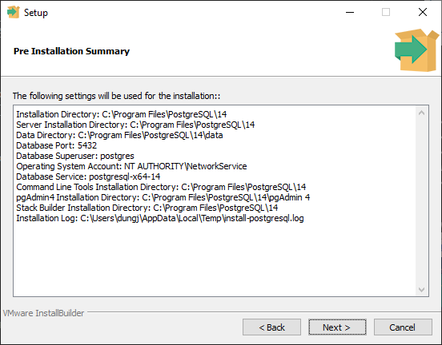
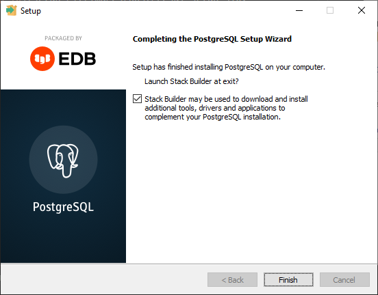

## Install PosgreSQL

## Download PosgreSQL
PosgreSQL can be downloaded [here](https://www.postgresql.org/download/). At this time (21-May-2022) latest version of PostgreSQL is 14.3.  

* Download process can be done using browser.
* Or using PowerShell  
```sh
>md d:\git-docs
>cd d:\git-docs
>Invoke-WebRequest https://get.enterprisedb.com/postgresql/postgresql-14.3-1-windows-x64.exe -OutFile posgresql.exe
>.\posgresql.exe
```

PowerShell downloading PostgreSQL like this.  


---
Follow installing instruction.  


Choose install directory - suggest to keep default value.  


Choose components to install - suggest to keep default value.  


Select directory to store the data - suggest to keep default value.  


Enter password for default logins. Default Username is: postgres  


Enter `port` for PostgreSQL connection. If you don't have conflict or special purpose, please keep default value 5432.  


Choose default locale of database - keep default if you don't have special purpose.  


Review selected options.  


Confirm installation.  


Installation in progress  


Wait and finish installation.  


**Note: Computer my restart to apply the changes.**

### Test PostgreSQL
You can use pgAdmin win all document can be found [here](https://www.pgadmin.org/docs/pgadmin4/development/getting_started.html).
I use HeidiSQL as my favour. It's an open source tool, lightweight yet powerful and easy to use. HeidiSQL can be downloaded [here](https://www.heidisql.com/).

Open HeidiSQL.  
  

Click `New` to add a connection session. Input information as the image. Imput user name `posgres`, password `use password you enter at installation step`. Click `Open`, if all information is correct and PostgreSQL install OK, you should go into manage page.
  
  
