## Install git

## Install git on Windows (Win dow 7, Windows 10, Windows 11)

### Download git-scm (use 64-bit version)
* Latest git installation file can be downloaded [here](https://git-scm.com/). Download manually and install.
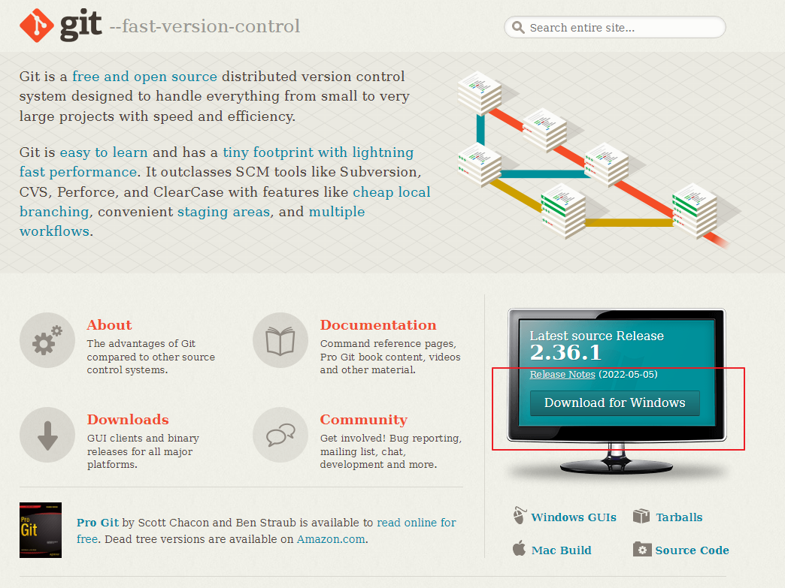
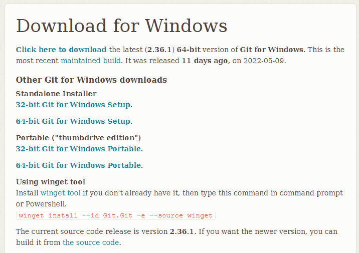
* Or download using PowerShell.
```sh
>mkdir D:\dit-docs
>cd d:\git-docs
>Invoke-WebRequest https://github.com/git-for-windows/git/releases/download/v2.36.1.windows.1/Git-2.36.1-64-bit.exe -OutFile git-scm.exe
>.\git-scm.exe
```

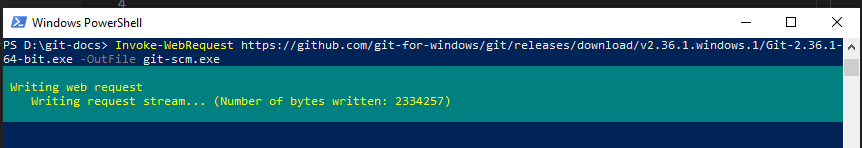
Follow installing step (Basically click Next following by Next).

---
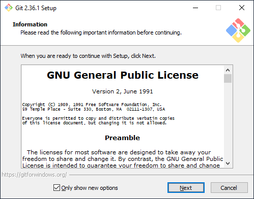
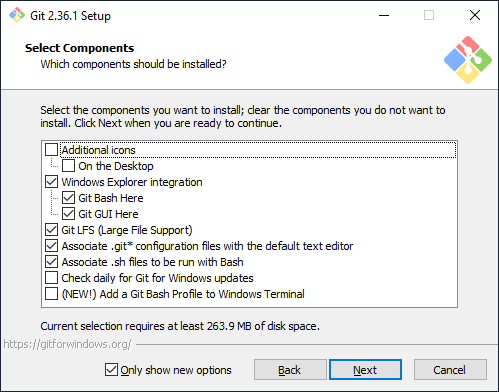
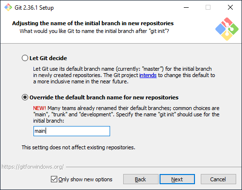
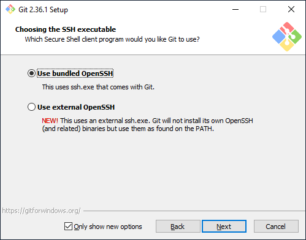
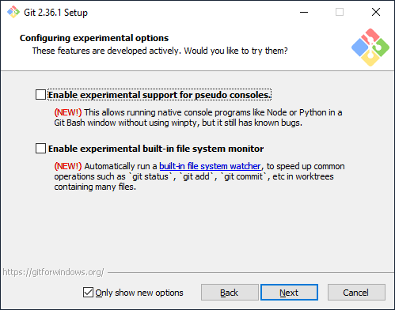
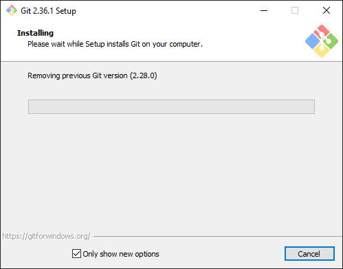
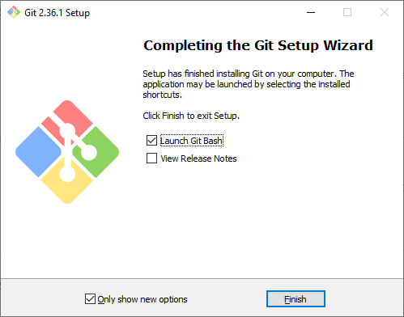

### Test git installation
Run following command to check if git installed correctly.
```sh
>git --version
```

You should see result like this.
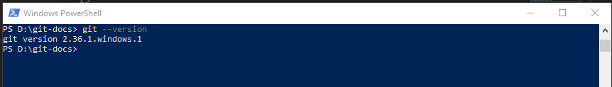

