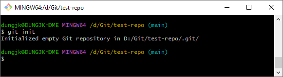

## [Install Git-scm](setup-git/install-git.md)

## [Cheatsheet](git-cheatsheet.md)

---
Samples using github as git server. All the step can be applied to any git server.  
All git commands can be reference [here](https://git-scm.com/docs/git).

**Note: All command should `cd` to working directory first.**
### Clone the code from exist repository.
Start git bash and run following command.
```sh
>git clone https://github.com/dungjk/test-repo.git
```
### Init new repository
Creating new local init repo.
```sh
>git init
```
  

### Add an origin
Should read about [git origin](https://git-scm.com/book/en/v2/Git-Basics-Working-with-Remotes) first.   
Add an origin. Origin is remote git server that you want to publish the code to. Skip this step if current code (local repo) is cloned from a remote server.  
Note: Local git repository can be linked to multiple origin. Following command add an origin named `origin` link to repository at `https://github.com/dungjk/test-repo.git`  
```sh
$ git remote add origin https://github.com/dungjk/test-repo.git
```

### Make changes and commit the code
Note: Git use `local` and `remote` (distributed) model. All changes at local should be push/publish to remote by your self.  
Make some changes.  

S1. Create a file `readme.md`.  
```sh
$ echo "Test content">readme.md
```
  


S2.1: Open file `readme.md` and edit it.  
```sh
$ nano readme.md
```
  

S2.2: Check change status.  
```sh
$ git status
```
We see a change on `readme.md`, marked as red color.  
  


S3: Stage the changes and commit.  
```sh
$ git add readme.md
$ git commit -m "Change readme.md content"
```
Note: `git add .` could be used to stage (all) all changes before commit.  
  

S4.1. Publish the changes of a new branch.  
```sh
$ git push -u origin main
```


S4.1 Make changes and push the changes.
```sh
$ git add .
$ git commit -m "Add new changes after publish branch""
$ git push
```  


### References
[Git document](https://git-scm.com/docs)
